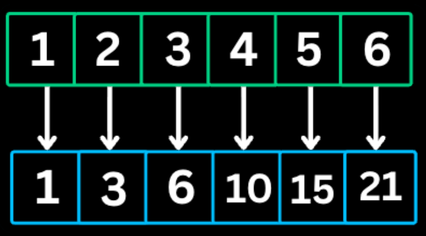

### DSA Patterns
---
##### Prefix Sum

Prefix sum is a pattern which involves in **preprocessing** an array to create a new array where each element at index i represents sum of all elemnts from the start upto i.This allows for **O(1) sum queries** on any subarray
*When to Use*
- Multiple sum queries on subarray
- Finding subarrays with target sum
- Calculating cummulative totals

```
//Template
// Build prefix sum array
int[] prefix = new int[n + 1];
for (int i = 0; i < n; i++) {
    prefix[i + 1] = prefix[i] + nums[i];
}

// Query sum of range [left, right]
int rangeSum = prefix[right + 1] - prefix[left];
```
The Fence Post Analogy
Imagine you are building a fence. You have 3 wooden panels (nums). To hold those panels up, you need 4 fence posts (prefix).Panel 0 is between Post 0 and Post 
1. Panel 1 is between Post 1 and Post 
2. Panel 2 is between Post 2 and Post 
3. Each Post represents the total amount of wood used up to that point.
1. Why $n + 1$?
If you have 3 panels ($n=3$), you naturally have 4 posts ($n+1$). You can't have a fence without a starting post!
Post 0: You haven't used any wood yet. (Value = 0)
Post 1: You've used the wood from Panel 0.
Post 2: You've used wood from Panel 0 + Panel 1.
Post 3: You've used all the wood.
2. Why the subtraction logic works
If I ask you: "How much wood is in the section from Panel 1 to Panel 2?
"You look at the "Total wood used" at the end of that section (Post 3) and subtract the "Total wood used" before that section started (Post 1).
The distance between Post 1 and Post 3 is the wood in Panel 1 and Panel 2.
3. Why it stops the "Negative Index" confusion
If I ask for the wood in Panel 0 to Panel 2 (the whole fence):
End point: Post 3.
Start point: Post 0.
Calculation: $\text{Post 3} - \text{Post 0}$.
Because we have that Post 0, you never have to go "behind" the start of the fence. 
You just point at the very first post.

*The Natural Realization:*
In any sequence of $N$ items, there are always $N+1$ boundaries between them (including the very start and the very end). Prefix sum arrays simply track the values at those boundaries rather than inside the items themselves.