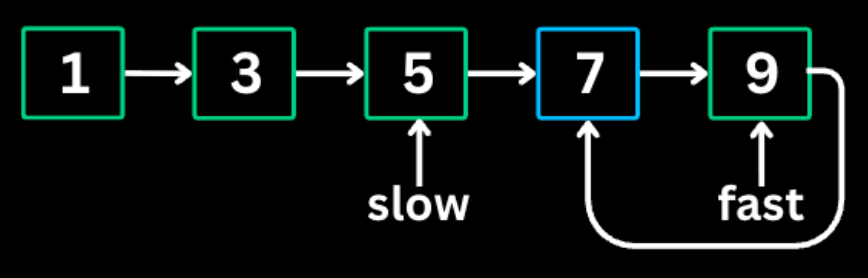
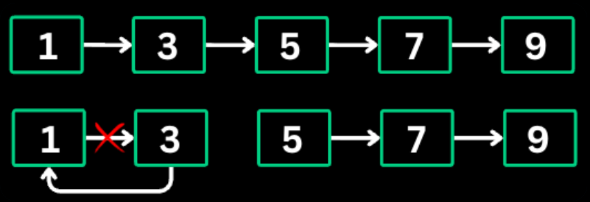
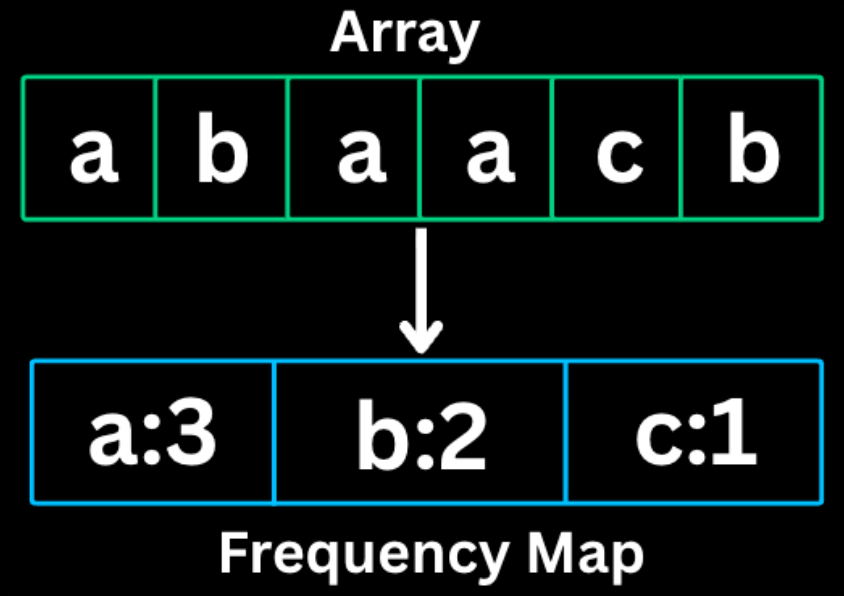

## DSA Patterns
---
### Prefix Sum


Prefix sum is a pattern which involves in **preprocessing** an array to create a new array where each element at index i represents sum of all elemnts from the start upto i.This allows for **O(1) sum queries** on any subarray.
*When to Use*
- Multiple sum queries on subarray
- Finding subarrays with target sum
- Calculating cummulative totals
- Whenever you see the words "Sum of Range," "Sub-array Sum," or "Average of a window."

```
//Template
// Build prefix sum array Java
int[] prefix = new int[n + 1];
for (int i = 0; i < n; i++) {
    prefix[i + 1] = prefix[i] + nums[i];
}

// Query sum of range [left, right]
int rangeSum = prefix[right + 1] - prefix[left];
```
The Fence Post Analogy
Imagine you are building a fence. You have 3 wooden panels (nums). To hold those panels up, you need 4 fence posts (prefix).Panel 0 is between Post 0 and Post 
1. Panel 1 is between Post 1 and Post 
2. Panel 2 is between Post 2 and Post 
3. Each Post represents the total amount of wood used up to that point.
1. Why $n + 1$?
If you have 3 panels ($n=3$), you naturally have 4 posts ($n+1$). You can't have a fence without a starting post!
Post 0: You haven't used any wood yet. (Value = 0)
Post 1: You've used the wood from Panel 0.
Post 2: You've used wood from Panel 0 + Panel 1.
Post 3: You've used all the wood.
2. Why the subtraction logic works
If I ask you: "How much wood is in the section from Panel 1 to Panel 2?
"You look at the "Total wood used" at the end of that section (Post 3) and subtract the "Total wood used" before that section started (Post 1).
The distance between Post 1 and Post 3 is the wood in Panel 1 and Panel 2.
3. Why it stops the "Negative Index" confusion
If I ask for the wood in Panel 0 to Panel 2 (the whole fence):
End point: Post 3.
Start point: Post 0.
Calculation: $\text{Post 3} - \text{Post 0}$.
Because we have that Post 0, you never have to go "behind" the start of the fence. 
You just point at the very first post.

*The Natural Realization:*
In any sequence of $N$ items, there are always $N+1$ boundaries between them (including the very start and the very end). Prefix sum arrays simply track the values at those boundaries rather than inside the items themselves.

---
### 2 Pointer


Two pointer pattern involves having 2 pointers to traverse an array or list ,typically from opposite ends or both moving in the same direction.It reduces time complexity from **O(n^2) to O(n)** for many array/string problems.
*When to Use*
- Finding pairs in sorted array
- Comparing elements from both ends
- Partitioning arrays
- Palindrome checks.

```
//Java
// Opposite direction (converging)
int left = 0, right = n - 1;
while (left < right) {
    if (condition_met) {
        // found answer
    } else if (need_larger_sum) {
        left++;
    } else {
        right--;
    }
}

// Same direction
int slow = 0;
for (int fast = 0; fast < n; fast++) {
    if (condition) {
        // process and move slow
        slow++;
    }
}
```

*The Logic:* 
- Why Move Left or Right?
This specific logic applies when you are looking for a Target Sum in a sorted array. We place one pointer (left) at the beginning and one pointer (right) at the end.
1. When Current Sum > Target Sum: 
Move the Right PointerIf your current sum is too large, you need to decrease it. Since the array is sorted, the largest values are on the right. Moving the right pointer one step to the left ($right--$) replaces a larger number with a smaller one, effectively lowering the total sum.
2. When Current Sum < Target Sum: 
Move the Left PointerIf your current sum is too small, you need to increase it. The smallest values are on the left. Moving the left pointer one step to the right ($left++$) replaces a smaller number with a larger one, increasing the total sum.

*To use this technique effectively, you need to verify these three pillars*:
1. The Pre-requisite: Sorting
The "increase/decrease" logic only works if the data is sorted. If the array isn't sorted, moving a pointer doesn't guarantee the sum will change in the direction you want.
Time Complexity Note: Sorting takes $O(n \log n)$. If the array is already sorted, the two-pointer part is $O(n)$.
2. The Loop Condition
The pointers should never cross. Your loop usually looks like:
` while (left < right) { ... } `
If they meet or cross, you’ve exhausted all possible pairs without finding the target.

---
### Sliding Window


The Sliding Window pattern maintains a window of elements and slides it acroos the array to find subArrays or subStrings that satisfies certain conditions.It avoids recalcuating overlapping parts of consecutive windows.
*When to Use*
- Problems involving consecutive Elements
- Longest/Shortest substring with certain properties
- Finding Maximum/Minimum in window of size k
- Contiguous substring/subarray problems.

```
//Java
// Fixed-size window
int windowSum = 0;
for (int i = 0; i < n; i++) {
    windowSum += nums[i];
    if (i >= k - 1) {
        // process window
        result = Math.max(result, windowSum);
        windowSum -= nums[i - k + 1];
    }
}

// Variable-size window
int left = 0;
for (int right = 0; right < n; right++) {
    // expand window by including nums[right]

    while (window_condition_violated) {
        // shrink window from left
        left++;
    }

    // update result
}
```

1. Fixed-Size Window: 
The "Subway Turnstile" Analogy
Imagine a Subway Train that can only fit exactly 3 people ($k=3$). 
The train moves along a platform of people.
The Logic: As the train moves one spot forward, one new person enters the front door, and 
one person must exit the back door to keep the capacity at exactly 3.
The Code Mental Model:
windowSum += nums[i]: 
The person at the front enters the train.
if (i >= k - 1): 
We don't start "processing" until the train is full (e.g., if $k=3$, we wait until index 2).
windowSum -= nums[i - k + 1]: 
Before the train moves to the next person, the person who has been in the train the longest exits from the back.
2. Variable-Size Window: 
The "Accordion" AnalogyImagine an Accordion or a Rubber Band. 
This window isn't stuck at one size; it expands and contracts based on a rule (the "condition").
The Logic:
 You keep stretching the accordion to the right to include more notes. If the sound becomes "distorted" (condition violated), you must pull the left side in to shorten it until the sound is clear again.
 The Code Mental Model:
 for (int right = 0; ...): 
 The Right Hand stretches the accordion out, adding one element at a time.
 while (condition_violated): 
 The Left Hand starts dragging the back end forward. It doesn't just move once; it keeps moving until the condition is happy again.
 left++: 
 This is the left hand catching up to fix the "distortion."

| **Feature** | **Fixed-Size** | **Variable-Size** |
| --- |  --- |  --- |
| **Trigger** | "Find the max sum of **exactly** K elements." | "Find the longest subarray with **at most** K unique elements." |
| **The "Left" Pointer** | Moves automatically once the window is full ($i - k + 1$). | Moves only when a specific rule is broken. |
| **Window State** | Constant size. | Elastic size (grows and shrinks). |

*Things to Note :*

1.  **The "Net Change" Rule:** In sliding window, never re-sum the whole window inside the loop. Just add the new `right` and subtract the old `left`. This is what makes it $O(n)$.

2.  **The "While" vs "If":** In Variable windows, use a `while` loop for the left pointer. Sometimes moving the left pointer once isn't enough to fix the condition (e.g., if you need to remove multiple elements to get back under a certain sum).

---
### Fast & Slow Pointer


The Fast & Slow Pointer pattern also known as Tortoise and Hare Pattern, has 2 pointer, moving at different speeds, When there is a cycle , the fast pointer eventually meets the slow pointer.

*When to use*
- Detecting cycles in linked lists or arrays
- Finding the middle of a linked list
- Finding the start of a cycle

```
//Java
// Find middle
while (fast != null && fast.next != null) {
    slow = slow.next;
    fast = fast.next.next;
}
return slow; // middle node

// Cycle detection
ListNode slow = head, fast = head;
while (fast != null && fast.next != null) {
    slow = slow.next;
    fast = fast.next.next;

    if (slow == fast) {
        // cycle detected
        return true;
    }
}
return false; // no cycle
```

1. **Finding the Middle: The "Speed Walkers" Analogy**
Imagine two friends, **Slow Sam** and **Fast Fred**, starting a race down a straight path.
-   **Sam** walks at a normal pace (**1 step** at a time).
-   **Fred** runs exactly **twice as fast** (**2 steps** at a time).
*The Mental Model:*
If Fred runs twice as fast as Sam, then at the exact moment Fred crosses the finish line, Sam will be exactly at the **halfway point**.
-   **The Code:** `fast.next.next` is Fred sprinting; `slow.next` is Sam walking.
-   **The Termination:** When Fred reaches the end (`fast == null`), Sam is your middle node. It's a perfect way to find the center of a Linked List in one single pass without needing to count the total length first.

2. **Cycle Detection: The "Circular Track" Analogy**
Now, imagine Sam and Fred are no longer on a straight path. They are running on a **circular stadium track**.
*The Mental Model:*
If there is a loop, Fred (the Hare) will eventually "lap" Sam (the Tortoise).
-   On a straight line, the gap between them just keeps growing, and Fred finishes while Sam is still in the middle.
-   On a **loop**, Fred enters the circle and starts going around and around. Eventually, he will come up from behind Sam and crash into him.

>**The Rule:** If `slow == fast` at any point, you are in a loop. If `fast` hits a `null` (the end of the road), there is no loop.

*Key Concepts to "Nail Down"*
1. The "Null" Safety Check
You'll notice the condition `while (fast != null && fast.next != null)`.
-   Because Fred moves **two steps**, you have to make sure the spot he's landing on (`fast.next`) and the spot he's jumping *over* (`fast`) both exist. If you don't check both, your code will "trip" and throw a NullPointer error.
2. The "Even vs. Odd" Result
-   **Odd number of nodes:** Sam will land exactly on the middle node.
-   **Even number of nodes:** Sam will land on the **second** middle node (e.g., in a list of 4, he lands on node 3). If you need the *first* middle node, you'd adjust the starting positions slightly.
3. Why it's Efficient
Most people's first instinct is to use a `HashSet` to store every node they've seen to detect a cycle. That costs **$O(n)$ space**. The Fast and Slow pointer technique uses **$O(1)$ space** (just two variables), which is why interviewers love it---it's the "memory-efficient" way to solve the problem.

| **Scenario** | **Fast Pointer Speed** | **Slow Pointer Speed** | **Goal** |
| --- |  --- |  --- |  --- |
| **Finding Middle** | 2x | 1x | Stop when Fast reaches the end. |
| **Cycle Detection** | 2x | 1x | Stop if Fast and Slow collide. |
| **K-th from End** | Constant Headstart | 1x | Maintain a specific gap between them. |

---
### LinkedList In-Place Reversal


This Pattern reverses parts of LinkedList without using extra space.It manipulates the pointer to reverse the direction of the links.

*When to use*
- Reversing a linked list or portion of it
- Reversing nodes in groups
- Checking for palindromes in linked lists

```
//Java
// Reverse entire list
ListNode prev = null, curr = head;
while (curr != null) {
    ListNode next = curr.next;
    curr.next = prev;
    prev = curr;
    curr = next;
}
return prev; // new head
```

Think of it like a **Relay Race**, but the runners are standing in a line and you are trying to change the direction of the baton pass.
**The Analogy: The "Baton Hand-off"**
Imagine four people (Nodes) standing in a line. Usually, **A** passes to **B**, **B** passes to **C**, and **C** passes to **D**. You want them to face the opposite way so **D** passes to **C**, **C** to **B**, and so on.
**The Code Mental Model:**
1.  **`ListNode next = curr.next;` (The "Hold this" step)** You are standing at **B**. Before you turn around to face **A**, you tap **C** on the shoulder and say, "Stay right there, I'm going to need to find you in a second." You *must* do this because once you turn your back, you lose sight of **C**.
2.  **`curr.next = prev;` (The "Turn Around" step)** You (**B**) physically turn your body away from **C** and face **A** (`prev`). You are now ready to pass your baton backward. The connection to the future is officially broken.
3.  **`prev = curr;` (The "New Target" step)** You tell **A**, "I'm done." Now, you become the person that the *next* runner will look at. You are now the "Previous" person for the runner behind you.
4.  **`curr = next;` (The "Next Runner" step)** You finally let go and move to **C** (the person you tapped on the shoulder in Step 1). Now **C** becomes the "Current" person, and the whole dance repeats.
**The "Why" behind the confusion**
The reason it feels weird is that the code looks like it's doing four different things, but it's really just **handling a hot potato.**

**Look at it this way:** If you were standing at Node B and you simply said "Point to A" (`curr.next = prev`) **without** first grabbing Node C (`next`), Node C and everything after it would drift away into space. You'd have no variable left that knows where Node C is.

*Summary Table*
| **The Code Line** | **The Physical Action** | **Why do it?** |
| --- |  --- |  --- |
| `next = curr.next` | **Grab** the next person's hand. | So they don't get lost when you turn around. |
| `curr.next = prev` | **Point** your pointer backward. | This is the actual "reversal" part. |
| `prev = curr` | **Shift** the "Previous" label to yourself. | To prepare the target for the next node's reversal. |
| `curr = next` | **Jump** to the person you grabbed in step 1. | To move the workspace forward. |

*Pro-Tip for your Mental Model:*
If you ever get stuck drawing this out, remember: **You can't point to the past until you've secured the future.** That's why `next = curr.next` **always** has to be the first thing inside that loop.

---
### Frequency Counting


The Frequency Counting pattern uses hashmaps or arrays to count occurences of elements.It transforms $O(n^2)$ lookup problems into $O(n)$ by trading space for time.

*When to use*
- Finding duplicates or unique elements
- Checking if two collections have same elements
- Finding elements that appear k times
- Anagram problems

```java
// Using HashMap
Map<Integer, Integer> freq = new HashMap<>();
for (int num : nums) {
    freq.put(num, freq.getOrDefault(num, 0) + 1);
}

// Using array (when range is known)
int[] freq = new int[26]; // for lowercase letters
for (char c : str.toCharArray()) {
    freq[c - 'a']++;
}

// Finding element with specific frequency
for (Map.Entry<Integer, Integer> entry : freq.entrySet()) {
    if (entry.getValue() == target) {
        return entry.getKey();
    }
}
```

**The Analogy: The "Post Office Sorting Room"**
Imagine you are a postal worker with a giant bag of mail. Each letter is addressed to a different "Category" (a number or a letter).

- **The Problem:** If you just keep the letters in the bag, and someone asks, "How many letters for Category A do we have?", you have to dig through the whole bag every single time ($O(n^2)$ complexity).
- **The Solution:** You set up a row of **Sorted Cubby Holes** (your Hashmap or Array). As you pull a letter out of the bag, you immediately toss it into its designated cubby.
- **The Result:** At the end, you don't need to search the bag anymore. You just look at the cubby and see how high the stack of mail is.