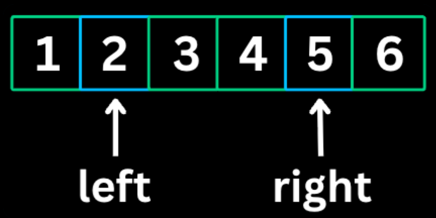
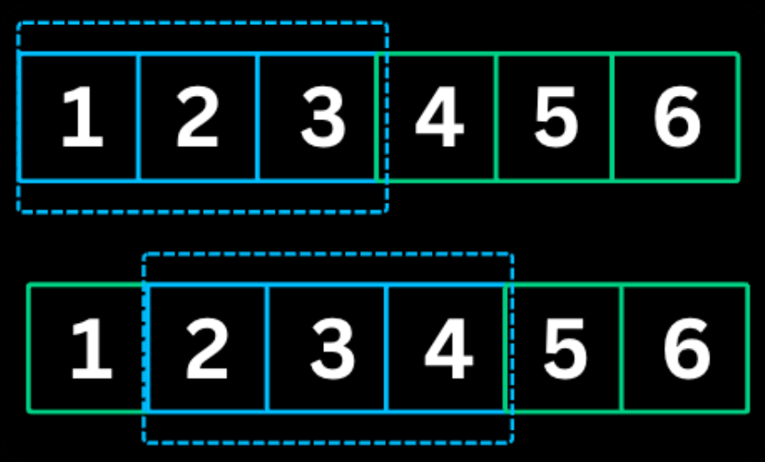

### DSA Patterns
---
##### Prefix Sum

Prefix sum is a pattern which involves in **preprocessing** an array to create a new array where each element at index i represents sum of all elemnts from the start upto i.This allows for **O(1) sum queries** on any subarray.
*When to Use*
- Multiple sum queries on subarray
- Finding subarrays with target sum
- Calculating cummulative totals
- Whenever you see the words "Sum of Range," "Sub-array Sum," or "Average of a window."

```
//Template
// Build prefix sum array Java
int[] prefix = new int[n + 1];
for (int i = 0; i < n; i++) {
    prefix[i + 1] = prefix[i] + nums[i];
}

// Query sum of range [left, right]
int rangeSum = prefix[right + 1] - prefix[left];
```
The Fence Post Analogy
Imagine you are building a fence. You have 3 wooden panels (nums). To hold those panels up, you need 4 fence posts (prefix).Panel 0 is between Post 0 and Post 
1. Panel 1 is between Post 1 and Post 
2. Panel 2 is between Post 2 and Post 
3. Each Post represents the total amount of wood used up to that point.
1. Why $n + 1$?
If you have 3 panels ($n=3$), you naturally have 4 posts ($n+1$). You can't have a fence without a starting post!
Post 0: You haven't used any wood yet. (Value = 0)
Post 1: You've used the wood from Panel 0.
Post 2: You've used wood from Panel 0 + Panel 1.
Post 3: You've used all the wood.
2. Why the subtraction logic works
If I ask you: "How much wood is in the section from Panel 1 to Panel 2?
"You look at the "Total wood used" at the end of that section (Post 3) and subtract the "Total wood used" before that section started (Post 1).
The distance between Post 1 and Post 3 is the wood in Panel 1 and Panel 2.
3. Why it stops the "Negative Index" confusion
If I ask for the wood in Panel 0 to Panel 2 (the whole fence):
End point: Post 3.
Start point: Post 0.
Calculation: $\text{Post 3} - \text{Post 0}$.
Because we have that Post 0, you never have to go "behind" the start of the fence. 
You just point at the very first post.

*The Natural Realization:*
In any sequence of $N$ items, there are always $N+1$ boundaries between them (including the very start and the very end). Prefix sum arrays simply track the values at those boundaries rather than inside the items themselves.

---
##### 2 Pointer

Two pointer pattern involves having 2 pointers to traverse an array or list ,typically from opposite ends or both moving in the same direction.It reduces time complexity from **O(n^2) to O(n)** for many array/string problems.
*When to Use*
- Finding pairs in sorted array
- Comparing elements from both ends
- Partitioning arrays
- Palindrome checks.

```
//Java
// Opposite direction (converging)
int left = 0, right = n - 1;
while (left < right) {
    if (condition_met) {
        // found answer
    } else if (need_larger_sum) {
        left++;
    } else {
        right--;
    }
}

// Same direction
int slow = 0;
for (int fast = 0; fast < n; fast++) {
    if (condition) {
        // process and move slow
        slow++;
    }
}
```

*The Logic:* 
- Why Move Left or Right?
This specific logic applies when you are looking for a Target Sum in a sorted array. We place one pointer (left) at the beginning and one pointer (right) at the end.
1. When Current Sum > Target Sum: 
Move the Right PointerIf your current sum is too large, you need to decrease it. Since the array is sorted, the largest values are on the right. Moving the right pointer one step to the left ($right--$) replaces a larger number with a smaller one, effectively lowering the total sum.
2. When Current Sum < Target Sum: 
Move the Left PointerIf your current sum is too small, you need to increase it. The smallest values are on the left. Moving the left pointer one step to the right ($left++$) replaces a smaller number with a larger one, increasing the total sum.

*To use this technique effectively, you need to verify these three pillars*:
1. The Pre-requisite: Sorting
The "increase/decrease" logic only works if the data is sorted. If the array isn't sorted, moving a pointer doesn't guarantee the sum will change in the direction you want.
Time Complexity Note: Sorting takes $O(n \log n)$. If the array is already sorted, the two-pointer part is $O(n)$.
2. The Loop Condition
The pointers should never cross. Your loop usually looks like:
` while (left < right) { ... } `
If they meet or cross, you’ve exhausted all possible pairs without finding the target.

---
##### Sliding Window

The Sliding Window pattern maintains a window of elements and slides it acroos the array to find subArrays or subStrings that satisfies certain conditions.It avoids recalcuating overlapping parts of consecutive windows.
*When to Use*
- Problems involving consecutive Elements
- Longest/Shortest substring with certain properties
- Finding Maximum/Minimum in window of size k
- Contiguous substring/subarray problems.

```
//Java
// Fixed-size window
int windowSum = 0;
for (int i = 0; i < n; i++) {
    windowSum += nums[i];
    if (i >= k - 1) {
        // process window
        result = Math.max(result, windowSum);
        windowSum -= nums[i - k + 1];
    }
}

// Variable-size window
int left = 0;
for (int right = 0; right < n; right++) {
    // expand window by including nums[right]

    while (window_condition_violated) {
        // shrink window from left
        left++;
    }

    // update result
}
```