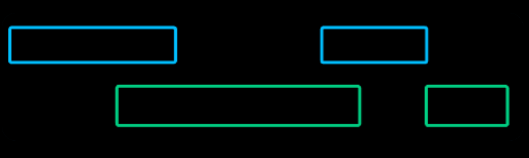
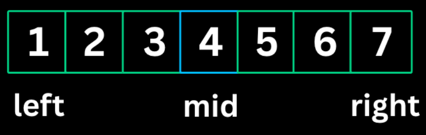
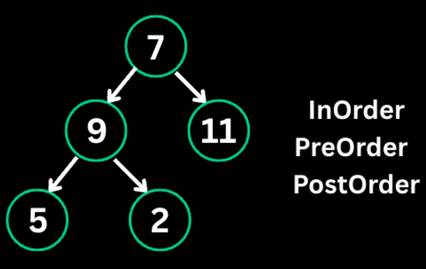

### Monotonic Stack


A Monotonic Stack pattern maintains elements in either increasing or decreasing order.As you iterate you pop out elements that violate the order, which reveals the relationship between elements.

*When to use*
- Finding the next greater/smaller element
- Finding previous greater/smaller element
- Problems involving spans or ranges
- Histogram problems

```java
//java
// Next Greater Element (decreasing stack)
int[] result = new int[n];
Arrays.fill(result, -1);
Stack<Integer> stack = new Stack<>(); // stores indices

for (int i = 0; i < n; i++) {
    while (!stack.isEmpty() && nums[i] > nums[stack.peek()]) {
        int idx = stack.pop();
        result[idx] = nums[i];
    }
    stack.push(i);
}
```

**The Analogy: The "Line of Sight" at a Concert**
Imagine a line of people of different heights standing in a row, all looking to the **right**.
- **The Scenario:** Each person wants to know: *"Who is the first person to my right that is taller than me?"*
- **The Rule:** If a very tall person arrives, they "block" the view of everyone shorter than them who came before.
**The Mental Model:**
Think of the **Stack** as a **Waiting Room** for people who haven't found their "Next Greater Person" yet.
1. **New Person Arrives (`nums[i]`):** They enter the room.
2. **The Confrontation (`while` loop):** They look at the people already sitting in the waiting room.
    - If the new person is **taller** than the person sitting there, the person in the chair has finally found their "Next Greater Element."
    - They get their answer, stand up, and **pop** out of the chair.
    - The new person keeps checking the next chair until they see someone taller than them or the room is empty.
3. **The Wait (`push`):** Once they've cleared out everyone shorter than them, the new person sits down in a chair to wait for *their* taller person to arrive.

**The "Nail Down" Summary**
- **When to use:** "Find the first element to the \[left/right\] that is \[smaller/larger\]."
- **The Stack Order:** In this "Next Greater" problem, the stack is always **decreasing**. As soon as a larger number appears, it breaks the pattern and pops the smaller ones.
- **Time Complexity:** It looks like $O(n^2)$ because of the nested `while` loop, but it is actually **$O(n)$**.
    - **Why?** Because every single element is pushed onto the stack exactly **once** and popped exactly **once**. No element is ever processed more than twice.

---

### Top 'K' Elements


This pattern finds K largest or smallest elements using heaps (priority Queues). A min-heap of size k keeps track of K largest elements.A Max-heap of size k keeps track of K smallest elements.

*When to use*
- Finding k largest/smallest elements
- Finding kth largest/smallest element
- Finding k most/least frequent elements
- Merging k sorted lists

```java
//Java
// K largest elements using min-heap
PriorityQueue<Integer> minHeap = new PriorityQueue<>();

for (int num : nums) {
    minHeap.offer(num);
    if (minHeap.size() > k) {
        minHeap.poll(); // remove smallest
    }
}
// minHeap now contains k largest elements
// minHeap.peek() is the kth largest
```

The **Top K Elements** pattern is your go-to strategy whenever a problem asks for the "K largest," "K most frequent," or "K closest" items.

## The "Top K Elements" Pattern

The **Top K Elements** pattern is an efficient way to find a specific number of "best" items (largest, smallest, most frequent) from a large dataset without sorting the entire collection.

**1. Definition**
A **Heap** (implemented as a `PriorityQueue` in Java) is a tree-based data structure that satisfies the **Heap Property**:
*   **Min-Heap:** The value of each node is greater than or equal to the value of its parent. The **smallest** element is always at the root (top).
*   **Max-Heap:** The value of each node is less than or equal to the value of its parent. The **largest** element is always at the root (top).

**2. The Analogy: The "VIP Club"**
Imagine a high-end club that only has **K seats**. 
*   **To get the K Largest:** You want to keep the strongest people. You put the **weakest** person currently inside right by the door (**Min-Heap top**). When a new person arrives, if they are stronger than the person at the door, the weak person is kicked out, and the new person joins.
*   **To get the K Smallest:** You put the **strongest** person by the door (**Max-Heap top**). If a "smaller" person arrives, the big person is kicked out.

**3. Step-by-Step Example**
**Problem:** Find the $K=3$ largest elements in `[15, 7, 11, 12, 5]`.
1. **Start Min-Heap:** Add 15, 7, 11. 
    * *Heap:* `[7, 11, 15]` (7 is at the top/door).
2. **Next is 12:** 12 is larger than the door (7).
    * *Action:* Kick out 7, add 12. 
    * *Heap:* `[11, 12, 15]` (11 is now the smallest/at the door).
3. **Next is 5:** 5 is smaller than the door (11).
    * *Action:* Ignore 5.
4. **Final Result:** `[11, 12, 15]` are your 3 largest elements.

**4. Mental Model: "The Survival Filter"**
Don't think of it as "sorting." Think of it as a **filter** with a limited capacity ($K$). By using a **Min-Heap** for "Largest" problems, you are effectively saying: *"I only care about you if you are bigger than the smallest person currently in my 'Top K' group."*

**5. Cheat Sheet: Java vs. JavaScript**

| Feature | Java (`PriorityQueue`) | JavaScript (Manual/Library) |
| :--- | :--- | :--- |
| **Declaration (Min)** | `PriorityQueue<Integer> pq = new PriorityQueue<>();` | `let pq = []; // Usually requires a class` |
| **Declaration (Max)** | `new PriorityQueue<>(Collections.reverseOrder());` | `// Custom comparator needed` |
| **Add Element** | `pq.offer(val);` | `// push + siftUp logic` |
| **Remove Top** | `pq.poll();` | `// pop + siftDown logic` |
| **Look at Top** | `pq.peek();` | `pq[0];` |
| **Size** | `pq.size();` | `pq.length;` |

> **Note:** JavaScript does not have a built-in Priority Queue. In interviews, you often have to implement a simple one or use a sorted array (though that changes complexity to $O(N \cdot K)$).

**6. The "Nail Down" Interview Summary**
* **Use Case:** Whenever you see "Kth largest," "Top K frequent," or "Closest K points."
* **Time Complexity:** $O(N \log K)$. This is significantly better than sorting ($O(N \log N)$) when $K$ is much smaller than $N$.
* **Space Complexity:** $O(K)$ to store the heap elements.
* **The Golden Rule:** 
    * To find **Largest** $\rightarrow$ Use **Min-Heap**.
    * To find **Smallest** $\rightarrow$ Use **Max-Heap**.

**7. Code Implementation (Java)**
```java
public int findKthLargest(int[] nums, int k) {
    // 1. Create a Min-Heap (The "VIP Club")
    PriorityQueue<Integer> minHeap = new PriorityQueue<>();

    for (int num : nums) {
        // 2. Offer the new number to the heap
        minHeap.offer(num);
        
        // 3. If we exceed K capacity, kick out the smallest
        if (minHeap.size() > k) {
            minHeap.poll(); 
        }
    }
    
    // 4. The top of the heap is the smallest of the K largest (the Kth largest)
    return minHeap.peek(); 
}
```
---

### Overlapping Intervals


This pattern handles problems involving intervals that may overlap. The key insight is that after sorting by start time, two intervals \[a, b\] and \[c, d\] overlap if b >= c.
*When to use*
- Merging overlapping intervals
- Finding interval intersections
- Scheduling problems (meeting rooms)
- Inserting into sorted intervals

```java
// Sort by start time
Arrays.sort(intervals, (a, b) -> a[0] - b[0]);

// Merge overlapping intervals
List<int[]> merged = new ArrayList<>();
for (int[] interval : intervals) {
    if (merged.isEmpty() || merged.get(merged.size() - 1)[1] < interval[0]) {
        // no overlap, add new interval
        merged.add(interval);
    } else {
        // overlap, merge by extending end time
        merged.get(merged.size() - 1)[1] =
            Math.max(merged.get(merged.size() - 1)[1], interval[1]);
    }
}
```

The **Overlapping Intervals** pattern is the ultimate strategy whenever you deal with time, schedules, meetings, or ranges that might bump into each other.
**1\. Definition**
An interval is represented as a pair of numbers: `[start, end]`.
The problem asks you to take a messy list of intervals (like calendar events) and combine any that overlap into a single, clean timeline.
**2\. The Analogy: The "Movie Marathon"**
Imagine you are a film critic planning a **Movie Marathon**. Directors are pitching you their movies, each with a `[start_time, end_time]`.
- **The Problem:** The pitches are handed to you in a completely chaotic, random order. Some movies overlap. You can't watch two movies at once!
- **Step 1: Line them up (Sorting):** The very first thing you must do to make sense of your day is to organize the movies by their **start times**. You line them up from morning to night.
- **Step 2: The "Continuous Stream" Check:** You look at the first movie. It ends at 2:00 PM.
        - If the next movie starts at 3:00 PM, there's no conflict! You get a break, and then you add it to your schedule (**No Overlap**).

        - If the next movie starts at 1:30 PM, it crashes into your current movie! Since you are already there, you merge them into one giant block of screen time, extending your end time to whichever movie ends later (**Overlap**).
**3\. Step-by-Step Example**
**Input:** `[[1, 3], [8, 10], [2, 6], [15, 18]]`
1. **Sort by Start Time:** `[[1, 3], [2, 6], [8, 10], [15, 18]]`
2. **Process `[1, 3]`:** Timeline is empty. Add it.
        - *Merged:* `[[1, 3]]`
3. **Process `[2, 6]`:** Does it overlap with the last item `[1, 3]`?
        - Yes, because its start time (`2`) is *before* the previous end time (`3`).
        - *Action:* Merge them! Max end time is `Math.max(3, 6) = 6`.
        - *Merged:* `[[1, 6]]`
4.  **Process `[8, 10]`:** Does it overlap with `[1, 6]`?
        - No, because `8 > 6`.
        - *Action:* Add it as a new block.
        - *Merged:* `[[1, 6], [8, 10]]`
5.  **Process `[15, 18]`:** No overlap (`15 > 10`). Add it.
        - *Final Result:* `[[1, 6], [8, 10], [15, 18]]`
**4\. Mental Model: "The Rubber Band"**
Think of your intervals as **Rubber Bands**.
Once sorted, you look at the incoming rubber band. If it catches onto the tail of your current rubber band, you **stretch** your current one to cover the new territory. If it doesn't touch, you lay down a brand new rubber band.
**5\. Line-by-Line Code Explanation (Java)**
Java
```
// 1. SORTING: Line up the pitches by morning-to-night order
// (a, b) -> a[0] - b[0] tells Java to compare the START times of both intervals.
Arrays.sort(intervals, (a, b) -> a[0] - b[0]);

// 2. THE SCHEDULE: A dynamic list to hold our final merged blocks
List<int[]> merged = new ArrayList<>();

for (int[] interval : intervals) {
    // 3. CASE A: No Overlap
    // If our schedule is empty, OR the current interval starts AFTER
    // the last merged interval ends, they don't touch.
    if (merged.isEmpty() || merged.get(merged.size() - 1)[1] < interval[0]) {
        merged.add(interval); // Safe to add as a brand new block
    }
    // 4. CASE B: Overlap
    else {
        // They touch! Stretch the end time of the last block to whichever is further out.
        merged.get(merged.size() - 1)[1] =
            Math.max(merged.get(merged.size() - 1)[1], interval[1]);
    }
}

```
**6\. The "Nail Down" Interview Summary**
- **The Critical Secret:** **Never** try to solve an interval problem without sorting by start time first. If you don't sort, you have to look ahead and backward constantly ($O(n^2)$).
- **Time Complexity:** **$O(n \\log n)$** because of the sorting step. The subsequent loop only takes $O(n)$ time.
- **Space Complexity:** **$O(n)$** to store the merged intervals.
- **The "Golden Condition":** Two sorted intervals `A` and `B` overlap if and only if:
    $$\\text{B.start} \\le \\text{A.end}$$
**7\. Cheat Sheet: Variations of this Pattern**
| **Problem Type** | **Core Logic** | **Golden Check** |
| --- |  --- |  --- |
| **Merge Intervals** | Combine overlaps together into one. | Stretch the end time: `Math.max(endA, endB)` |
| **Insert Interval** | Add an interval into an already sorted list, then merge. | Find position, insert, run merge logic. |
| **Meeting Rooms** | Can a person attend all meetings? (True/False) | If `B.start < A.end`, return `false` instantly. |
| **Meeting Rooms II** | Find the *minimum* rooms needed. | Use a **Min-Heap** to track room end-times. |

---

### Modified Binary Search


This pattern adapts binary search to handle rotated arrays, finding boundaries, or searching for conditions rather than exact values.

*When to use*
- Searching in rotated sorted arrays
- Finding first/last occurrence of element
- Finding minimum/maximum satisfying a condition
- Peak finding problems
  
```java
// Standard binary search
int left = 0, right = n - 1;
while (left <= right) {
    int mid = left + (right - left) / 2;
    if (nums[mid] == target) return mid;
    else if (nums[mid] < target) left = mid + 1;
    else right = mid - 1;
}

// Find first occurrence
while (left < right) {
    int mid = left + (right - left) / 2;
    if (condition(mid)) right = mid;
    else left = mid + 1;
}
```
Standard Binary Search is used to find a single target in a sorted list. **Modified Binary Search** is used when the data isn't perfectly sorted (e.g., rotated arrays) or when you need to find a boundary---like the *first* or *last* time an element appears.
**1\. The Analogy: The "Faulty Assembly Line"**
Imagine you run a factory that makes smartphones. Somewhere mid-day, a machine broke down and started cracking the screens. All phones made *before* that moment are perfect; all phones made *after* are broken.
```
[Perfect, Perfect, Perfect, Broken, Broken, Broken, Broken]

```
- **The Goal:** Find the **exact first phone** that was broken so you can pinpoint when the machine failed.
- **The Strategy:** You can't check all 10,000 phones one by one ($O(n)$). Instead, you look at the middle phone:
        - If the middle phone is **Broken**, you know the failure happened *at or before* this phone. You don't need to check anything to its right. You discard the right half, but you **keep this middle phone** as your current best guess.
        - If the middle phone is **Perfect**, you know the failure happened strictly *after* this phone. You discard this phone and everything to its left.
**2\. Line-by-Line Code Breakdown**
Let's look at why the two templates are written differently. This is where most developers get tripped up.
**Code 1: Standard Binary Search (The Exact Match)**
Use this when you are looking for a specific, unique number.
Java
```
int left = 0, right = n - 1;

// 1. Why "<=" ? Because left and right can meet on the exact target.
// If the array has 1 element, left == right, and we still need to check it!
while (left <= right) {

    // 2. Why this math instead of (left + right) / 2?
    // To prevent "Integer Overflow". If left and right are huge numbers,
    // adding them together might crash your program. This subtraction keeps it safe.
    int mid = left + (right - left) / 2;

    // 3. The Perfect Hit: Found it, leave immediately.
    if (nums[mid] == target) return mid;

    // 4. The target is in the right half, step past mid.
    else if (nums[mid] < target) left = mid + 1;

    // 5. The target is in the left half, step behind mid.
    else right = mid - 1;
}

```
**Code 2: Modified Binary Search (The Boundary Finder)**
Use this when finding the *first occurrence*, *last occurrence*, or a *tipping point*.
Java
```
// 1. Why "<" instead of "<="?
// Because we are shrinking a window to trap a SINGLE index.
// The loop ends when left == right. That final standing index is your answer.
while (left < right) {
    int mid = left + (right - left) / 2;

    // 2. The Condition Met (e.g., "Is the phone broken?")
    if (condition(mid)) {
        // Why "right = mid" instead of "mid - 1"?
        // Because this 'mid' phone IS broken! It might be the FIRST broken phone.
        // We cannot throw it away. We move the right wall TO 'mid' to keep it in play.
        right = mid;
    }
    // 3. The Condition Failed (e.g., "The phone is perfect")
    else {
        // Why "mid + 1"?
        // Because this phone is perfect, so it definitely isn't the first broken one.
        // We can safely discard it and move to the next index.
        left = mid + 1;
    }
}
// When the loop ends, left == right, pointing directly at the boundary.
return left;

```
**3\. Mental Model: "Trapping the Target"**
- In **Standard Search**, you are a sniper taking individual shots. If `mid` hits the target, you win.
- In **Modified Search**, you are a trash compactor. The two walls (`left` and `right`) close in on both sides until they squeeze exactly one element between them.
**4\. Cheat Sheet: Comparison Table**

| **Feature** | **Standard Binary Search** | **Modified (Boundary) Search** |
| --- |  --- |  --- |
| **Loop Condition** | `while (left <= right)` | `while (left < right)` |
| --- |  --- |  --- |
| **Mid Match** | `if (nums[mid] == target) return mid;` | No early return. Keep shrinking. |
| **Moving Left** | `left = mid + 1;` | `left = mid + 1;` |
| **Moving Right** | `right = mid - 1;` | `right = mid;` (Keep mid in play) |
| **Loop Exit State** | `left > right` (Target not found) | `left == right` (Pointing at boundary) |

**5\. The "Nail Down" Interview Summary**
- **When to use:** Whenever an array is sorted, partially sorted (rotated), or exhibits a clear binary property (like `[False, False, True, True]`).
- **Time Complexity:** Always **$O(\\log n)$** because you eliminate half of the remaining elements at every single step.
- **Space Complexity:** **$O(1)$** as it only requires a few pointers.
- **The Mid Trap:** If you ever write `right = mid` and your mid calculation rounds down, you can create an **infinite loop**.
        - *Rule of thumb:* If your code uses `left = mid`, calculate your mid by rounding up: `int mid = left + (right - left + 1) / 2;`.
**6\. Variations of this Pattern**
| **Problem** | **Modification** |
| --- |  --- |
| **Search in Rotated Sorted Array** | Check which half of the array is normally sorted before deciding where to throw away data. |
| **Find Peak Element** | Check if `nums[mid] < nums[mid + 1]` to see if you are walking up or down a mountain slope. |
| **Capacity to Ship Packages within D Days** | Binary search on the *answer range* (min weight capacity to max weight capacity). |

---

### Binary Tree Traversal


Binary Tree Traversal visits all nodes in a specific order. The three main orders are preorder (root-left-right), inorder (left-root-right), and postorder (left-right-root).

*When to use*
- Processing tree nodes in specific order
- Building trees from traversals
- BST operations (inorder gives sorted order)
- Tree serialization/deserialization