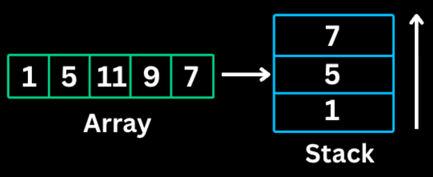
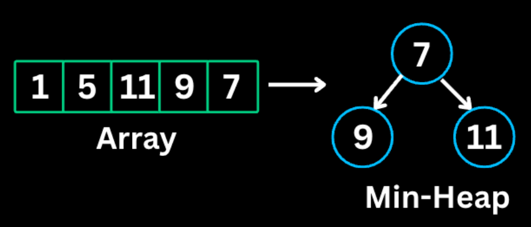

### Monotonic Stack


A Monotonic Stack pattern maintains elements in either increasing or decreasing order.As you iterate you pop out elements that violate the order, which reveals the relationship between elements.

*When to use*
- Finding the next greater/smaller element
- Finding previous greater/smaller element
- Problems involving spans or ranges
- Histogram problems

```java
//java
// Next Greater Element (decreasing stack)
int[] result = new int[n];
Arrays.fill(result, -1);
Stack<Integer> stack = new Stack<>(); // stores indices

for (int i = 0; i < n; i++) {
    while (!stack.isEmpty() && nums[i] > nums[stack.peek()]) {
        int idx = stack.pop();
        result[idx] = nums[i];
    }
    stack.push(i);
}
```

**The Analogy: The "Line of Sight" at a Concert**
Imagine a line of people of different heights standing in a row, all looking to the **right**.
- **The Scenario:** Each person wants to know: *"Who is the first person to my right that is taller than me?"*
- **The Rule:** If a very tall person arrives, they "block" the view of everyone shorter than them who came before.
**The Mental Model:**
Think of the **Stack** as a **Waiting Room** for people who haven't found their "Next Greater Person" yet.
1. **New Person Arrives (`nums[i]`):** They enter the room.
2. **The Confrontation (`while` loop):** They look at the people already sitting in the waiting room.
    - If the new person is **taller** than the person sitting there, the person in the chair has finally found their "Next Greater Element."
    - They get their answer, stand up, and **pop** out of the chair.
    - The new person keeps checking the next chair until they see someone taller than them or the room is empty.
3. **The Wait (`push`):** Once they've cleared out everyone shorter than them, the new person sits down in a chair to wait for *their* taller person to arrive.

**The "Nail Down" Summary**
- **When to use:** "Find the first element to the \[left/right\] that is \[smaller/larger\]."
- **The Stack Order:** In this "Next Greater" problem, the stack is always **decreasing**. As soon as a larger number appears, it breaks the pattern and pops the smaller ones.
- **Time Complexity:** It looks like $O(n^2)$ because of the nested `while` loop, but it is actually **$O(n)$**.
    - **Why?** Because every single element is pushed onto the stack exactly **once** and popped exactly **once**. No element is ever processed more than twice.

---

### Top 'K' Elements


This pattern finds K largest or smallest elements using heaps (priority Queues). A min-heap of size k keeps track of K largest elements.A Max-heap of size k keeps track of K smallest elements.

*When to use*
- Finding k largest/smallest elements
- Finding kth largest/smallest element
- Finding k most/least frequent elements
- Merging k sorted lists

```java
//Java
// K largest elements using min-heap
PriorityQueue<Integer> minHeap = new PriorityQueue<>();

for (int num : nums) {
    minHeap.offer(num);
    if (minHeap.size() > k) {
        minHeap.poll(); // remove smallest
    }
}
// minHeap now contains k largest elements
// minHeap.peek() is the kth largest
```

The **Top K Elements** pattern is your go-to strategy whenever a problem asks for the "K largest," "K most frequent," or "K closest" items.

## The "Top K Elements" Pattern

The **Top K Elements** pattern is an efficient way to find a specific number of "best" items (largest, smallest, most frequent) from a large dataset without sorting the entire collection.

**1. Definition**
A **Heap** (implemented as a `PriorityQueue` in Java) is a tree-based data structure that satisfies the **Heap Property**:
*   **Min-Heap:** The value of each node is greater than or equal to the value of its parent. The **smallest** element is always at the root (top).
*   **Max-Heap:** The value of each node is less than or equal to the value of its parent. The **largest** element is always at the root (top).

**2. The Analogy: The "VIP Club"**
Imagine a high-end club that only has **K seats**. 
*   **To get the K Largest:** You want to keep the strongest people. You put the **weakest** person currently inside right by the door (**Min-Heap top**). When a new person arrives, if they are stronger than the person at the door, the weak person is kicked out, and the new person joins.
*   **To get the K Smallest:** You put the **strongest** person by the door (**Max-Heap top**). If a "smaller" person arrives, the big person is kicked out.

**3. Step-by-Step Example**
**Problem:** Find the $K=3$ largest elements in `[15, 7, 11, 12, 5]`.
1. **Start Min-Heap:** Add 15, 7, 11. 
    * *Heap:* `[7, 11, 15]` (7 is at the top/door).
2. **Next is 12:** 12 is larger than the door (7).
    * *Action:* Kick out 7, add 12. 
    * *Heap:* `[11, 12, 15]` (11 is now the smallest/at the door).
3. **Next is 5:** 5 is smaller than the door (11).
    * *Action:* Ignore 5.
4. **Final Result:** `[11, 12, 15]` are your 3 largest elements.

**4. Mental Model: "The Survival Filter"**
Don't think of it as "sorting." Think of it as a **filter** with a limited capacity ($K$). By using a **Min-Heap** for "Largest" problems, you are effectively saying: *"I only care about you if you are bigger than the smallest person currently in my 'Top K' group."*

**5. Cheat Sheet: Java vs. JavaScript**

| Feature | Java (`PriorityQueue`) | JavaScript (Manual/Library) |
| :--- | :--- | :--- |
| **Declaration (Min)** | `PriorityQueue<Integer> pq = new PriorityQueue<>();` | `let pq = []; // Usually requires a class` |
| **Declaration (Max)** | `new PriorityQueue<>(Collections.reverseOrder());` | `// Custom comparator needed` |
| **Add Element** | `pq.offer(val);` | `// push + siftUp logic` |
| **Remove Top** | `pq.poll();` | `// pop + siftDown logic` |
| **Look at Top** | `pq.peek();` | `pq[0];` |
| **Size** | `pq.size();` | `pq.length;` |

> **Note:** JavaScript does not have a built-in Priority Queue. In interviews, you often have to implement a simple one or use a sorted array (though that changes complexity to $O(N \cdot K)$).

**6. The "Nail Down" Interview Summary**
* **Use Case:** Whenever you see "Kth largest," "Top K frequent," or "Closest K points."
* **Time Complexity:** $O(N \log K)$. This is significantly better than sorting ($O(N \log N)$) when $K$ is much smaller than $N$.
* **Space Complexity:** $O(K)$ to store the heap elements.
* **The Golden Rule:** 
    * To find **Largest** $\rightarrow$ Use **Min-Heap**.
    * To find **Smallest** $\rightarrow$ Use **Max-Heap**.

**7. Code Implementation (Java)**
```java
public int findKthLargest(int[] nums, int k) {
    // 1. Create a Min-Heap (The "VIP Club")
    PriorityQueue<Integer> minHeap = new PriorityQueue<>();

    for (int num : nums) {
        // 2. Offer the new number to the heap
        minHeap.offer(num);
        
        // 3. If we exceed K capacity, kick out the smallest
        if (minHeap.size() > k) {
            minHeap.poll(); 
        }
    }
    
    // 4. The top of the heap is the smallest of the K largest (the Kth largest)
    return minHeap.peek(); 
}
```